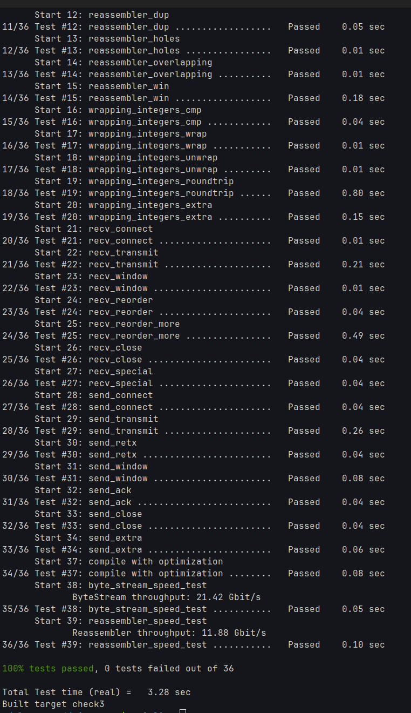

## 实验结果截图和文本


```
$ cmake --build build --target check3 >> report.md
Test project /home/isapo/playground/minnow/build
      Start  1: compile with bug-checkers
 1/36 Test  #1: compile with bug-checkers ........   Passed    0.20 sec
      Start  3: byte_stream_basics
 2/36 Test  #3: byte_stream_basics ...............   Passed    0.01 sec
      Start  4: byte_stream_capacity
 3/36 Test  #4: byte_stream_capacity .............   Passed    0.01 sec
      Start  5: byte_stream_one_write
 4/36 Test  #5: byte_stream_one_write ............   Passed    0.01 sec
      Start  6: byte_stream_two_writes
 5/36 Test  #6: byte_stream_two_writes ...........   Passed    0.01 sec
      Start  7: byte_stream_many_writes
 6/36 Test  #7: byte_stream_many_writes ..........   Passed    0.06 sec
      Start  8: byte_stream_stress_test
 7/36 Test  #8: byte_stream_stress_test ..........   Passed    0.07 sec
      Start  9: reassembler_single
 8/36 Test  #9: reassembler_single ...............   Passed    0.01 sec
      Start 10: reassembler_cap
 9/36 Test #10: reassembler_cap ..................   Passed    0.01 sec
      Start 11: reassembler_seq
10/36 Test #11: reassembler_seq ..................   Passed    0.01 sec
      Start 12: reassembler_dup
11/36 Test #12: reassembler_dup ..................   Passed    0.05 sec
      Start 13: reassembler_holes
12/36 Test #13: reassembler_holes ................   Passed    0.01 sec
      Start 14: reassembler_overlapping
13/36 Test #14: reassembler_overlapping ..........   Passed    0.01 sec
      Start 15: reassembler_win
14/36 Test #15: reassembler_win ..................   Passed    0.18 sec
      Start 16: wrapping_integers_cmp
15/36 Test #16: wrapping_integers_cmp ............   Passed    0.04 sec
      Start 17: wrapping_integers_wrap
16/36 Test #17: wrapping_integers_wrap ...........   Passed    0.01 sec
      Start 18: wrapping_integers_unwrap
17/36 Test #18: wrapping_integers_unwrap .........   Passed    0.01 sec
      Start 19: wrapping_integers_roundtrip
18/36 Test #19: wrapping_integers_roundtrip ......   Passed    0.83 sec
      Start 20: wrapping_integers_extra
19/36 Test #20: wrapping_integers_extra ..........   Passed    0.16 sec
      Start 21: recv_connect
20/36 Test #21: recv_connect .....................   Passed    0.01 sec
      Start 22: recv_transmit
21/36 Test #22: recv_transmit ....................   Passed    0.21 sec
      Start 23: recv_window
22/36 Test #23: recv_window ......................   Passed    0.01 sec
      Start 24: recv_reorder
23/36 Test #24: recv_reorder .....................   Passed    0.04 sec
      Start 25: recv_reorder_more
24/36 Test #25: recv_reorder_more ................   Passed    0.49 sec
      Start 26: recv_close
25/36 Test #26: recv_close .......................   Passed    0.04 sec
      Start 27: recv_special
26/36 Test #27: recv_special .....................   Passed    0.04 sec
      Start 28: send_connect
27/36 Test #28: send_connect .....................   Passed    0.04 sec
      Start 29: send_transmit
28/36 Test #29: send_transmit ....................   Passed    0.27 sec
      Start 30: send_retx
29/36 Test #30: send_retx ........................   Passed    0.04 sec
      Start 31: send_window
30/36 Test #31: send_window ......................   Passed    0.09 sec
      Start 32: send_ack
31/36 Test #32: send_ack .........................   Passed    0.04 sec
      Start 33: send_close
32/36 Test #33: send_close .......................   Passed    0.04 sec
      Start 34: send_extra
33/36 Test #34: send_extra .......................   Passed    0.06 sec
      Start 37: compile with optimization
34/36 Test #37: compile with optimization ........   Passed    0.07 sec
      Start 38: byte_stream_speed_test
35/36 Test #38: byte_stream_speed_test ...........   Passed    0.05 sec
      Start 39: reassembler_speed_test
36/36 Test #39: reassembler_speed_test ...........   Passed    0.10 sec

100% tests passed, 0 tests failed out of 36

Total Test time (real) =   3.32 sec
Built target check3
```

## 实验报告

1. Program Structure and Design of the TCPSender
   - 用队列`queue<TCPSenderMessage>`维护outstanding序列.
   - 自定义函数`make_message(size_t size)`产生单个发送消息,负责维护是否发送过标志位,限制产生的 payload 大小,
   限制整体大小不超过`size`, 若暂时没有消息或者发送完, 返回`make_empty_message()`, `push`函数按照约定调用它.
   - 效率
     1. 维护 outstanding 序列的不同的实现效率差异应该为常数.
     2. 但是 `make_message` 不显然. 我们的策略是不断`peek`并`append`. 更好的选择或许是先统计出新 payload 的总长度, 按需 `reserve`.

2. Implementation Challenges && Remaining Bugs:
   - 有很多 corner cases 测试集或许没有覆盖.
   - 文档没有写明的情况: 接收方返回了一个不合理的ACK(在seqno之后), 测试暗示我们忽略这次ACK. 为什么?
   - `set_error` 后应该返回`RST = true`的空消息, 并且调用 `push` 时应当 `transmit` 这个 `RST = true` 的数据.
   - 对方 `RST` 的行为? 这里设置了 `input_.set_error()`.
   - 文档没有提到, 也没有测试的行为
     - 所有的旧发送都被确认后, 新的发送是否应该重置计时器?
