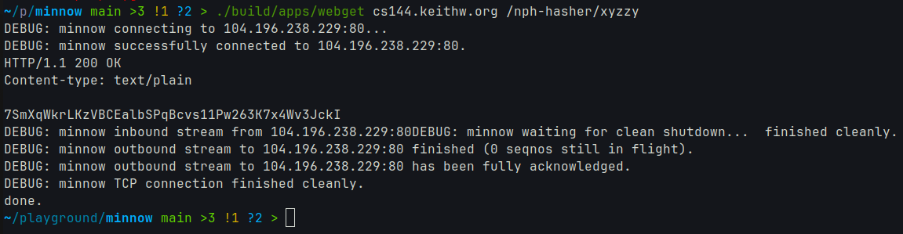
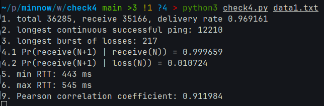
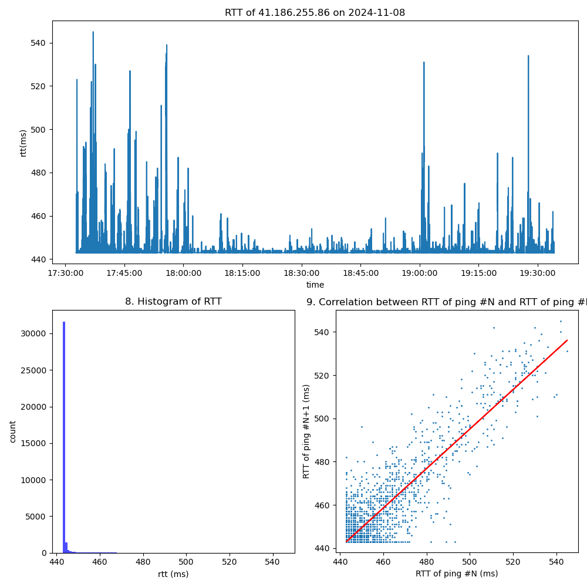
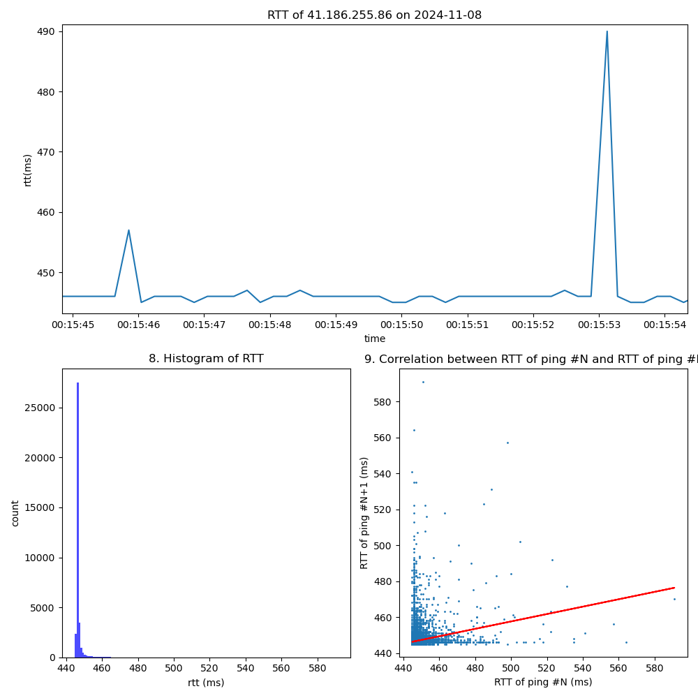
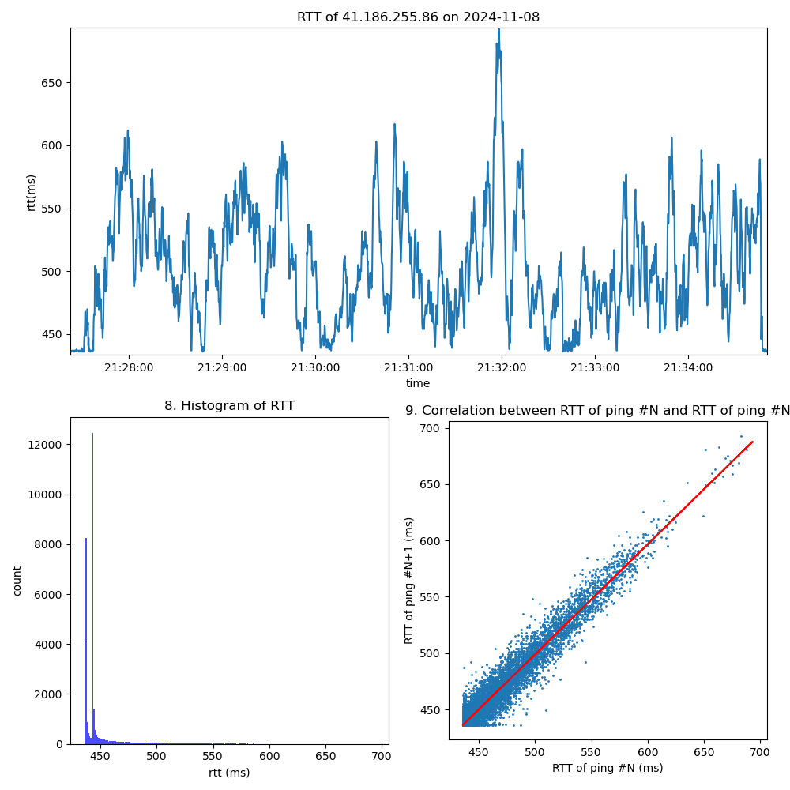
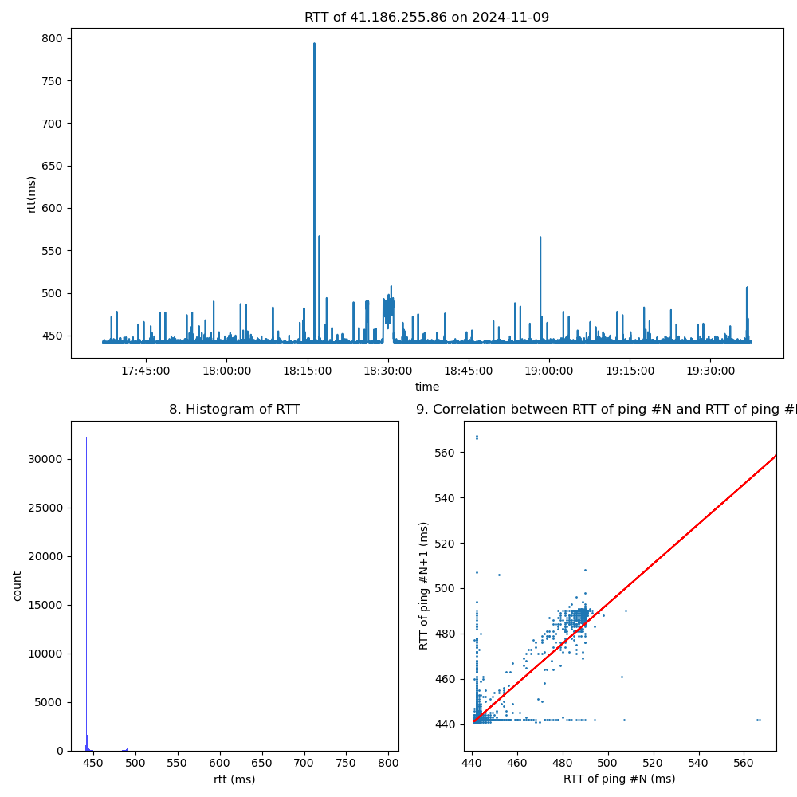

# 3. My TCP in real world
```
$ ./build/apps/webget cs144.keithw.org /nph-hasher/xyzzy
DEBUG: minnow connecting to 104.196.238.229:80...
DEBUG: minnow successfully connected to 104.196.238.229:80.
HTTP/1.1 200 OK
Content-type: text/plain

7SmXqWkrLKzVBCEalbSPqBcvs11Pw263K7x4Wv3JckI
DEBUG: minnow inbound stream from 104.196.238.229:80 finished cleanly.
DEBUG: minnow waiting for clean shutdown... DEBUG: minnow outbound stream to 104.196.238.229:80 finished (0 seqnos still in flight).
DEBUG: minnow outbound stream to 104.196.238.229:80 has been fully acknowledged.
DEBUG: minnow TCP connection finished cleanly.
done.
```



# 5. Collect ping data and analysis

我用指定代码收集了约 2h 的数据共 7 份, 并写了一个python脚本完成9个问题的回答.

数据见 `writeups/check4/data[0-6].txt`, 脚本为 `writeups/check4/check4.py`. 用法 `python3 check4.py {FILENAME}`.

数据中, 5份通过有线网卡接入校园网(0-5), 2份通过无线网卡接入(6-7); 2份 ping adobe-aem.map.fastly.net (0,2), 5份 ping 41.186.255.86 (其余).

下面是有较多丢包的 `data1.txt` 的结果.






4. 3. 分析的时间段内, 该网络的丢包总体发生频率为 4%, 丢包有突发性, 一次丢包发生后, 下一个包也丢失的概率高达 99%. 表明丢包可能是突发拥塞所导致.

---
9. 用一次函数拟合的结果较好, 皮尔逊相关系数为0.91, 表明他们是强正相关的. 图3(9)中,数据大部分堆积在左下角, 部分分散在拟合直线的两侧. 这可能是单峰状波动的恢复速度不同造成的, 一些网络波动在测量的200ms内迅速恢复, 产生了图4的RTT#N-#N+1关系图; 一些网络波动在几秒内恢复, 所以能观察到RTT先上升后下降, 表现为图5; 图6是振荡形式波动的网络.

10. 总体上, 本实验分析得到的 RTT of PING 和这篇论文 [@acharya1998study] 的特征一致.







其他: 我也做了时间序列分析的尝试, 没有较好的结果.
