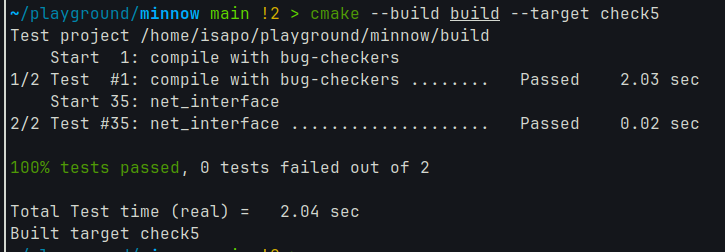

## 1. 实验结果



## 2. 数据结构设计

主要使用了以下数据结构:

1. `unordered_map<uint32_t, vector<EthernetFrame>> datagrams_`
   - 存储等待ARP响应的数据报文
   - key为目标IP地址
   - value为待发送的以太网帧列表

2. `unordered_map<uint32_t, uint64_t> arp_request_time_` 
   - 记录上一次ARP请求的时间
   - 用于限制ARP请求频率(5秒内不重复请求)

3. `unordered_map<uint32_t, EthernetAddress> arp_cache_`
   - 缓存IP地址到MAC地址的映射
   - 有效期30秒

4. `queue<pair<uint64_t, uint32_t>> arp_mapping_time_`
   - 记录ARP缓存项的创建时间
   - 用于实现缓存过期

## 3. 关键实现

### 3.1 发送数据报文

代码:

```28:49:src/network_interface.cc
void NetworkInterface::send_datagram( const InternetDatagram& dgram, const Address& next_hop )
{
  EthernetFrame frame {
    {{}, ethernet_address_, EthernetHeader::TYPE_IPv4},
    serialize(dgram),
  };
  // if next_hop is known
  auto arp_cache_it = arp_cache_.find(next_hop.ipv4_numeric());
  if (arp_cache_it != arp_cache_.end()) {
    EthernetAddress dstAddr = arp_cache_it->second;
    frame.header.dst = dstAddr;
    transmit(frame);
  } else {
    auto [it, succ] = arp_request_time_.try_emplace(next_hop.ipv4_numeric(), time_ms_);
    if (succ || it->second + 5000 < time_ms_) {
      transmit_arp(next_hop.ipv4_numeric());
      it->second = time_ms_;
    }
    // append dgram to queue
    datagrams_[next_hop.ipv4_numeric()].push_back(std::move(frame));
  }
}
```


1. 如果目标IP的MAC地址在缓存中,直接发送
2. 否则:
   - 将数据报文加入等待队列
   - 如果需要发送ARP请求(首次或超过5秒),则发送

### 3.2 接收以太网帧

代码:

```52:97:src/network_interface.cc
void NetworkInterface::recv_frame( const EthernetFrame& frame )
{
  if (frame.header.dst != ETHERNET_BROADCAST && frame.header.dst != ethernet_address_)
    return;
  switch (frame.header.type) {
    case EthernetHeader::TYPE_IPv4:
    {
      InternetDatagram datagram;
      if (parse(datagram, frame.payload)) {
        datagrams_received_.push(datagram);
      } else {
        std::cerr << "fail parsing ethernet frame " << frame.header.to_string() << std::endl;
      }
      break;
    }
    case EthernetHeader::TYPE_ARP:
    {
      ARPMessage arp;
      if (parse(arp, frame.payload)) {
        // rembember
        arp_cache_[arp.sender_ip_address] = arp.sender_ethernet_address;
        arp_mapping_time_.emplace(time_ms_, arp.sender_ip_address);

        auto it = datagrams_.find(arp.sender_ip_address);
        if (it != datagrams_.end()) {
          for (auto& dgram : it->second) {
            dgram.header.dst = arp.sender_ethernet_address;
            transmit(dgram);
          }
          datagrams_.erase(it);
        }

        // hanle arp request
        if (arp.opcode == ARPMessage::OPCODE_REQUEST &&
            arp.target_ip_address == ip_address_.ipv4_numeric()) {
          transmit_arp(arp.sender_ip_address, arp.sender_ethernet_address);
        }
      } else {
        std::cerr << "fail parsing ethernet frame " << frame.header.to_string() << std::endl;
      }
      break;
    }
    default:
      std::cerr << "bad ethernet frame " << frame.header.to_string() << std::endl;
  }
}
```


1. 检查目标MAC地址是否匹配
2. 根据帧类型处理:
   - IPv4: 解析并传递给上层
   - ARP: 更新缓存,发送响应,处理等待队列

## 4. 设计权衡

### 4.1 数据结构选择

1. 使用哈希表(`unordered_map`)而不是有序表(`map`)
   - 优点:查找和插入O(1)
   - 缺点:内存开销较大
   - 权衡:ARP表项数量有限,性能更重要

2. 使用队列存储缓存时间
   - 优点:简单高效地维护过期时间
   - 缺点:删除中间项困难
   - 权衡:ARP表项按时间顺序过期,不需要中间删除

### 4.2 替代方案分析

1. 延迟删除方案
   - 使用时检查过期,延迟删除
   - 优点:实现简单
   - 缺点:内存使用效率低

## 5. 性能分析

1. 时间复杂度
   - 发送/接收数据报文: O(1)
   - ARP缓存更新: O(1)
   - 定期清理过期项: O(k), k为过期项数量

2. 空间复杂度
   - ARP缓存: O(n), n为活跃IP数量
   - 等待队列: O(m), m为等待ARP响应的数据报文数量

## 6. 实现难点

1. 正确处理ARP缓存过期
2. 维护等待队列与ARP响应的同步
3. 处理各种边界情况(重复请求、无效响应等)
