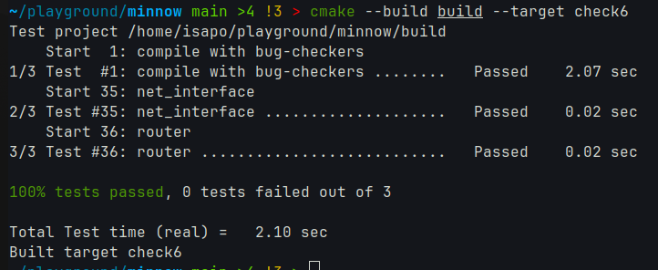
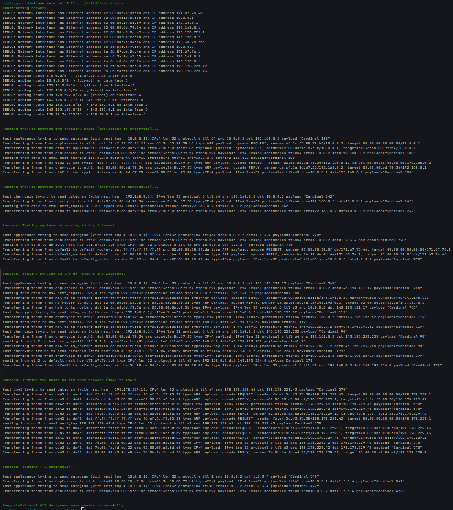

## 实验结果截图



## 关键设计

1. 数据结构:

- 使用 `Route` 结构体存储路由表条目，包含：
  1. prefix_: 经过掩码处理后的路由前缀
  2. mask_: 根据前缀长度计算的掩码值
  3. next_hop: std::optional<Address> 类型，表示下一跳地址
  4. interface_num_: 出接口编号
- 使用 vector<Route> route_table_ 存储所有路由条目

2. 路由算法实现:

- add_route 实现:
  1. 输入验证：确保前缀长度 ≤ 32
  2. 掩码计算：使用 UINT32_MAX << (32 - prefix_length) 生成掩码
  3. 规范化前缀：使用 route_prefix & mask 确保前缀正确性
  4. 路由表更新：将新路由条目添加到 route_table_

- route 实现:
  1. 接口遍历：遍历所有网络接口的接收队列
  2. TTL 处理：检查并递减 TTL，若 TTL ≤ 1 则丢弃
  3. 最长前缀匹配：
    3.1 使用 mask_ >= mask 确保选择最长匹配
    3.2 使用 prefix_ == (mask_ & dst) 验证前缀匹配
  4. 下一跳确定：
    4.1 直连路由：使用目的地址作为下一跳
    4.2 间接路由：使用配置的 next_hop
  5. 转发：调用对应接口的 send_datagram 方法

优点：

- 设计简单直观，易于实现和维护
- 使用 vector 存储路由表便于遍历
- 清晰地分离了路由表管理和数据转发逻辑

缺点：

- 路由表查找时间复杂度为 O(n)，对大规模路由表性能不佳
- 可以考虑使用前缀树(Trie)优化查找性能

Implementation Challenges:

1. 正确处理 TTL 和校验和更新
   - 别忘了 `dgram.header.compute_checksum()`!
2. 实现最长前缀匹配算法时需要注意掩码比较逻辑, 避免 UB。
3. 区分直连路由和间接路由的 next_hop 处理

Remaining Bugs:

- 路由表查找可能需要更高效的数据结构来优化性能

## 发现测试框架代码的漏洞？

- 在 `tests/router.cc` 中，网络接口数据转发直接在 `transmit` 中完成，导致 `transmit` 返回前，`recv_frame` 已经接受到返回的数据包。
  如果没有在 `transmit` 前维护状态机，则会导致错误的行为。
- 具体来说，修改这部分代码的顺序会使得测试结果出错。
```cpp
// network_interface.cc NetworkInterface::send_datagram

// CORRECT
// 1. append dgram to queue
datagrams_[next_hop.ipv4_numeric()].push_back(std::move(frame));
// 2. transmit arp request
auto [it, succ] = arp_request_time_.try_emplace(next_hop.ipv4_numeric(), time_ms_);
if (succ || it->second + 5000 < time_ms_) {
  it->second = time_ms_;
  transmit_arp(next_hop.ipv4_numeric());
}

// INCORRECT
// 1. transmit arp request
auto [it, succ] = arp_request_time_.try_emplace(next_hop.ipv4_numeric(), time_ms_);
if (succ || it->second + 5000 < time_ms_) {
  it->second = time_ms_;
  transmit_arp(next_hop.ipv4_numeric());
}
// 2. append dgram to queue
datagrams_[next_hop.ipv4_numeric()].push_back(std::move(frame));
```

## 补充实验结果截图

直接与运行 `build/tests/router` 的结果如下


