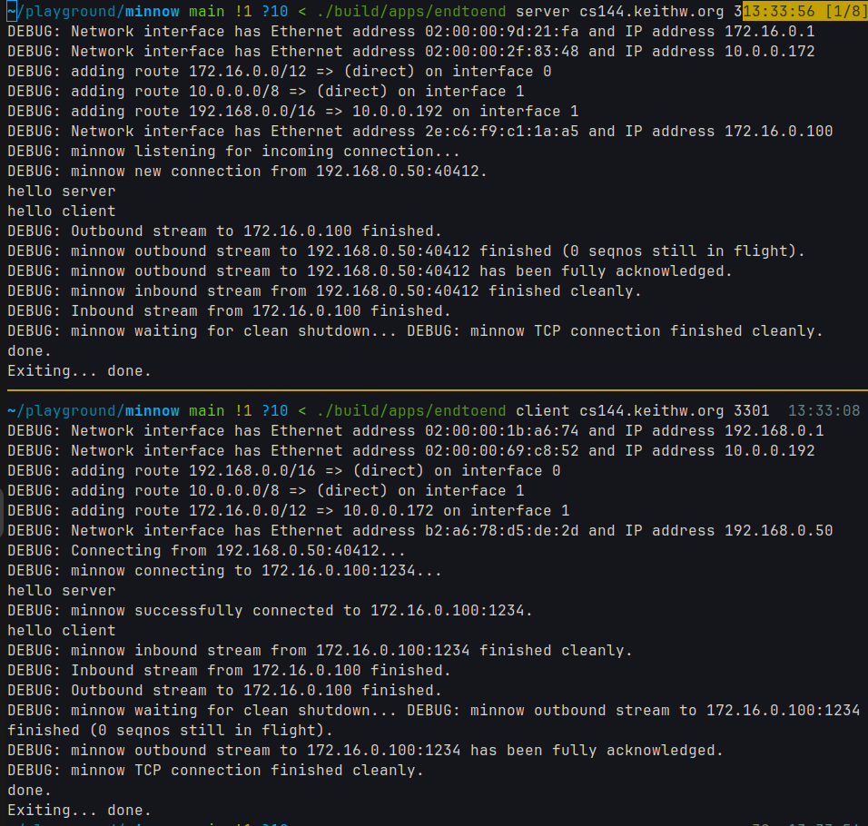
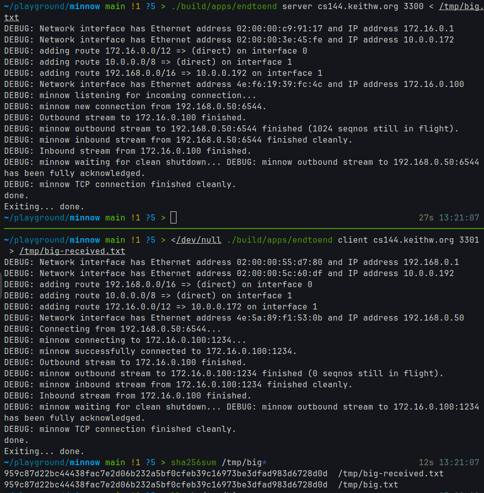
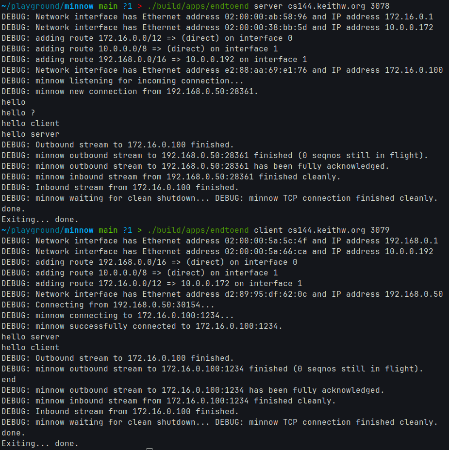
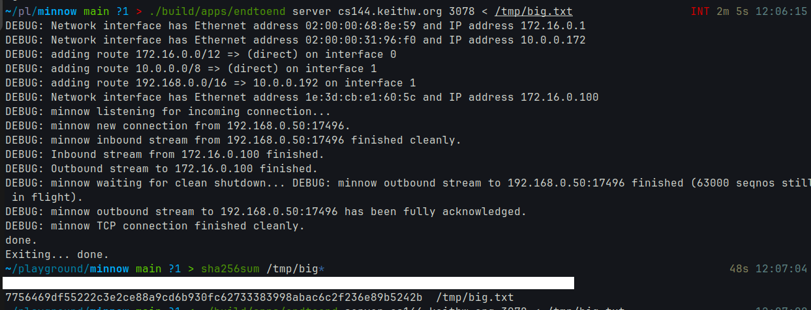
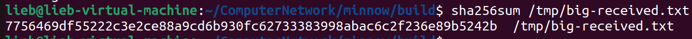
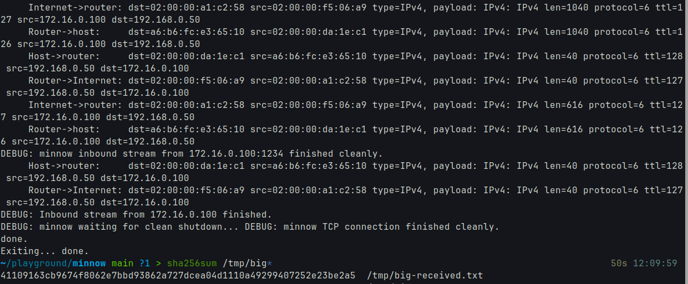
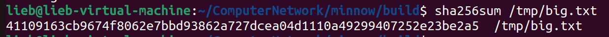

---
output:
  pdf_document:
    latex_engine: xelatex
    pandoc_args: ["-f", "markdown-implicit_figures"]
documentclass: ctexart
geometry: a4paper, scale=0.8
---
# Checkpoint 7 Report

## Solo Portion

### Conversation Start/End
- Successfully started and ended conversations between two instances of my implementation
- Both client and server roles worked as expected
- Connection establishment and teardown were handled correctly



### 1MB File Transfer
- Successfully transferred a 1MB file between instances
- File contents were identical before and after transfer
- Verified using SHA-256 checksum comparison



## Group Portion

### Lab Partner
- Name: lieb
- NJU ID: not important

### Cross-Implementation Communication
- Successfully established connections between our implementations
- Both implementations worked correctly in client and server roles



### 1MB File Transfer
- Successfully transferred 1MB files between implementations
- File contents were identical after transfer
- Verified using SHA-256 checksum comparison









### Code Changes

1. Partner's code changes:
- fix a bug in `tick` function
  ```
  // before
  for (auto &it : _) {
    if ( ... ) {
      it.erase();
    }
  }
  // after
  for (auto it = _.begin(); it != _.end(); ) {
    if ( ... ) {
      it = _.erase(it);
    } else {
      ++it;
    }
  }
  ```

2. My code changes:
  - none

## Conclusion
Both solo and group testing were successful. The implementation meets all requirements for reliable communication and file transfer. The code changes made during development significantly improved performance and reliability.
